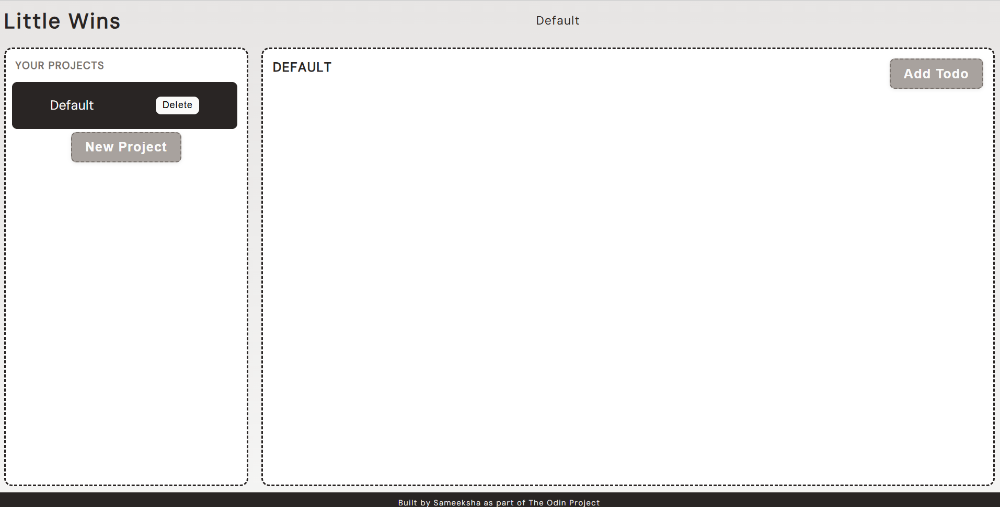
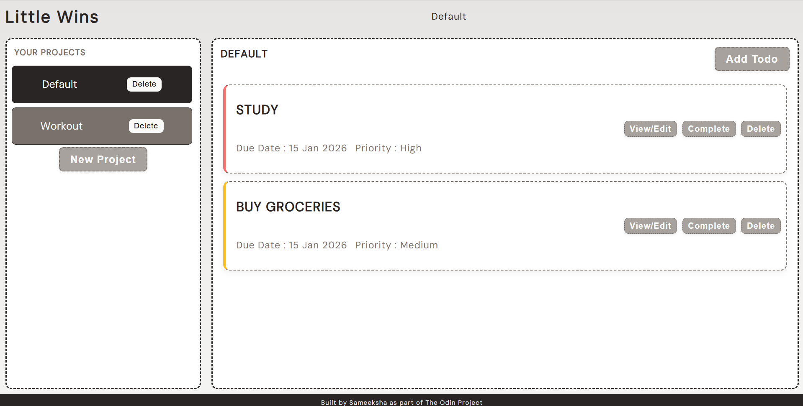
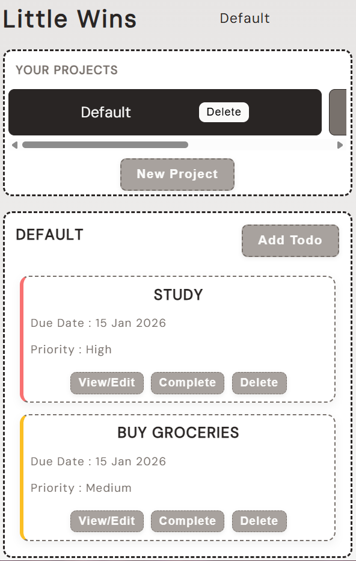

# Little Wins – Todo App

## Description
A simple and intuitive todo app to manage your daily tasks and projects. Built with **JavaScript**, **HTML**, and **CSS**, using **localStorage** for persistence.

---

## Features
- Add, edit, and delete **todos**.  
- Create, switch, and delete **projects**.  
- Todos have **title, due date, priority**, and optional **description/notes**.  
- Persistent storage with **localStorage**.  
- Responsive design for **desktop and mobile**.  

---

## Live Link
[https://sameeksha-dalvi.github.io/little-wins/](https://sameeksha-dalvi.github.io/little-wins/)

---

## Technologies Used
- HTML5, CSS3, JavaScript (ES6)  
- Web Storage API (`localStorage`)  
- [date-fns](https://date-fns.org/)  

---

## Screenshots

**Default / Empty Project View**  
  

**Final Screen with Added Todos**  
  

**Mobile / Responsive View**  
